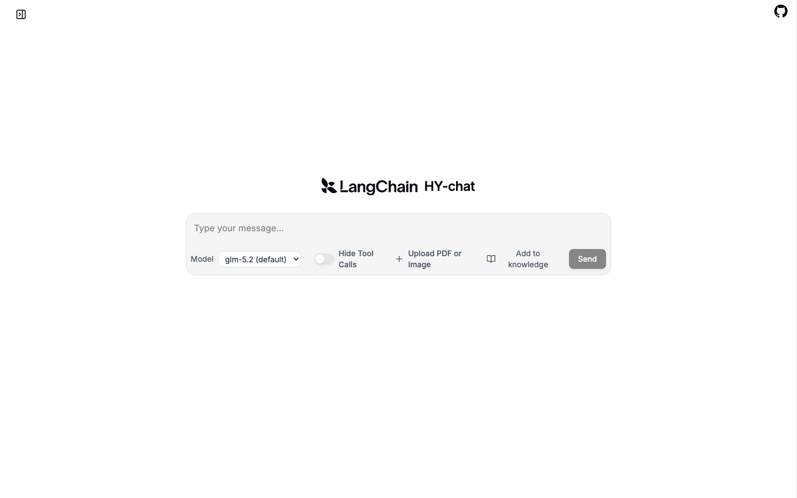

# HY-chat

HY-chat 是一个面向多用户的 AI 聊天工作台，基于 LangChain Agent Chat UI、LangGraph、FastAPI、PostgreSQL/pgvector、Redis 和 S3 兼容对象存储构建。



## 能力概览

- 响应式聊天界面，支持桌面、平板和手机
- 多轮对话、会话历史、新建与切换会话
- 注册、登录、JWT Access/Refresh Token、保存并切换多个账号
- 管理员与普通用户角色，以及简单的 Web 管理后台
- 每用户模型白名单、RPM、月 Token 配额、图片生成和高成本工具权限
- PDF、DOCX、PPTX、XLSX、TXT、Markdown、HTML、CSV、JSON RAG
- Tavily Web Search、Open-Meteo Weather、Alpha Vantage Stock Tool Calling
- 动态模型选择、LangGraph 流式协议与 FastAPI SSE
- 模型和工具 Trace：输入、输出、耗时、Token、状态与错误
- 图片工作台：智谱/OpenAI 文生图、OpenAI 图生图、Mock 全链路自测
- 本地文件存储或 AWS S3、MinIO、Cloudflare R2 等 S3 兼容存储
- Redis 对话、Embedding、RAG 和外部工具缓存

## Docker Compose 启动

```bash
cp .env.example .env
```

至少修改 JWT 密钥；使用真实模型时再填写智谱 Key：

```env
JWT_SECRET_KEY=请替换为足够长的随机字符串
ZHIPU_API_KEY=
TAVILY_API_KEY=
ALPHA_VANTAGE_API_KEY=
```

启动全部服务：

```bash
docker compose up --build
```

访问地址：

- Web UI：<http://localhost:3000>
- FastAPI / OpenAPI：<http://localhost:8000/docs>
- 健康检查：<http://localhost:8000/health>

LangGraph Agent Server 在 Compose 网络中由 Web UI 的 `/api` 反向代理访问，不再直接暴露 `2024` 端口，避免绕过 JWT 和线程权限。首次注册的账号自动成为管理员，后续注册账号默认为普通用户。

## 本地开发

先准备 PostgreSQL（带 pgvector）与 Redis，并把 `.env` 中的连接地址改成本机地址。然后启动 FastAPI：

```bash
uv sync
uv run uvicorn app.main:app --reload --port 8000
```

另开终端启动 Agent Server：

```bash
uv run langgraph dev --host 0.0.0.0 --port 2024 --no-browser
```

再启动前端：

```bash
cd frontend
cp .env.example .env.local
corepack pnpm install --frozen-lockfile
corepack pnpm dev
```

前端浏览器访问 `/api`，Next.js 服务端通过 `LANGGRAPH_API_URL=http://localhost:2024` 转发到 Agent Server，并保留浏览器发送的 Bearer Token。

## 身份认证与账号切换

Web UI 可直接注册和登录。REST 调用先获取 Token：

```bash
curl -X POST http://localhost:8000/auth/register \
  -H 'Content-Type: application/json' \
  -d '{"email":"admin@example.com","password":"change-me-123","display_name":"Admin"}'
```

响应包含 `access_token`、`refresh_token` 和当前用户策略。后续请求加入：

```bash
-H 'Authorization: Bearer <access_token>'
```

相关接口：

- `POST /auth/login`
- `POST /auth/refresh`
- `GET /auth/me`
- `POST /auth/logout-all`：递增 Token 版本，使该账号已有 Token 全部失效

前端账号菜单可以保存多个已登录账号并切换。Token 存储在浏览器本地存储中，因此生产部署需要同时启用严格 CSP、HTTPS，并避免引入不可信前端脚本。

## AI 权限与后台管理

管理员访问 <http://localhost:3000/admin>，可以配置：

- 管理员或普通用户角色、账号启停
- 可调用模型列表
- 每分钟模型请求次数
- 每月 Token 配额
- 是否允许图片生成
- 是否允许 Web Search、Stock 等高成本工具

这些策略由 Agent Server 的模型/工具中间件执行，不依赖前端按钮是否显示。Redis 用于原子 RPM 计数；模型和 Token 权限仍由数据库强制执行，Redis 暂时不可用时聊天不会整体中断。

## 会话与 Trace

左侧会话栏支持新建和切换会话。LangGraph 自定义认证会在创建线程时写入 owner，并在读取、搜索、更新、运行时按 owner 过滤。

本地 Trace 页面：<http://localhost:3000/traces>。REST 接口：

```bash
curl http://localhost:8000/traces \
  -H 'Authorization: Bearer <access_token>'

curl http://localhost:8000/traces/<trace_id> \
  -H 'Authorization: Bearer <access_token>'
```

如配置 `LANGSMITH_API_KEY` 与 `LANGSMITH_TRACING=true`，仍可同时在 LangSmith 中查看更完整的分布式 Trace。

## RAG 知识库

聊天输入区的“加入知识库”支持常见办公文档。所有文档和向量检索均按用户隔离。

```bash
curl -X POST http://localhost:8000/rag/documents \
  -H 'Authorization: Bearer <access_token>' \
  -F 'file=@./example.pdf'

curl -X POST http://localhost:8000/rag/search \
  -H 'Authorization: Bearer <access_token>' \
  -H 'Content-Type: application/json' \
  -d '{"query":"文档的核心结论是什么？","top_k":4}'
```

配置 `ZHIPU_API_KEY` 时使用 `embedding-3`；未配置时使用确定性的本地哈希向量，便于开发测试，但检索质量较低。

## S3 与文件存储

默认使用 Docker Volume 中的本地存储：

```env
STORAGE_BACKEND=local
LOCAL_STORAGE_DIR=/data/storage
MAX_UPLOAD_BYTES=52428800
```

切换到 S3 或兼容服务：

```env
STORAGE_BACKEND=s3
S3_ENDPOINT_URL=
S3_REGION=us-east-1
S3_BUCKET=hy-chat
S3_ACCESS_KEY_ID=
S3_SECRET_ACCESS_KEY=
S3_PUBLIC_BASE_URL=
S3_PRESIGN_EXPIRY_SECONDS=900
```

`S3_ENDPOINT_URL` 留空表示 AWS S3；使用 MinIO/R2 时填写对应端点。凭据留空时 boto3 会使用其标准凭据链。下载默认返回短时预签名 URL；请保持 Bucket 私有并为运行身份配置最小权限。

文件接口支持图片和普通文件：

- `POST /files`
- `GET /files`
- `GET /files/{id}/content`
- `GET /files/{id}/download-url`
- `DELETE /files/{id}`

RAG 原始文件和模型生成图片也会进入同一存储层。

## 文生图与图生图

图片工作台：<http://localhost:3000/images>。

- 不上传来源图：文生图，`auto` 会优先使用已配置的智谱图片模型
- 上传 JPG、PNG 或 WebP：图生图，`auto` 会使用 OpenAI Images Edit
- 未配置图片 Key：自动使用 Mock Provider，仍会完整验证权限、上传、数据库和存储链路

配置：

```env
ZHIPU_IMAGE_MODEL=glm-image
OPENAI_IMAGE_API_KEY=
OPENAI_IMAGE_BASE_URL=https://api.openai.com/v1
OPENAI_IMAGE_MODEL=gpt-image-2
IMAGE_INPUT_MAX_BYTES=52428800
```

智谱当前图片生成 API 是文本输入，因此不把“视觉理解后重写提示词”冒充成图生图。真正的图片编辑走 `/v1/images/edits`。REST 接口：

```bash
# 文生图
curl -X POST http://localhost:8000/images/generations \
  -H 'Authorization: Bearer <access_token>' \
  -F 'prompt=一只戴围巾的猫' \
  -F 'provider=auto' \
  -F 'size=1024x1024'

# 图生图
curl -X POST http://localhost:8000/images/generations \
  -H 'Authorization: Bearer <access_token>' \
  -F 'prompt=把它改成水彩插画' \
  -F 'source_image=@./source.png;type=image/png' \
  -F 'provider=auto'
```

其他接口：`GET /images/capabilities`、`GET /images/generations`、`GET /images/generations/{id}`。聊天 Agent 也可以先调用 `list_stored_images`，再把 `source_file_id` 交给 `generate_image` 完成图生图。

Coding Agent 路由已从含义不清的 `/agent/*` 调整为：

- `POST /coding-agent/runs`
- `GET /coding-agent/runs`
- `GET /coding-agent/runs/{id}`

## 模型、工具、SSE 与 Cache

```bash
curl http://localhost:8000/models -H 'Authorization: Bearer <access_token>'
curl http://localhost:8000/tools -H 'Authorization: Bearer <access_token>'
curl http://localhost:8000/cache/health
```

FastAPI SSE：

```bash
curl -N -X POST http://localhost:8000/chat/stream \
  -H 'Authorization: Bearer <access_token>' \
  -H 'Content-Type: application/json' \
  -d '{"message":"查询上海天气并总结","model":"glm-4-flash"}'
```

事件类型为 `metadata`、`token`、`done` 和 `error`。缓存命中状态位于 `metadata.cache_hit`。Redis 不可用时缓存自动降级。

## 验证

```bash
uv run pytest -q
uv run ruff check app tests
cd frontend && corepack pnpm@10.5.1 build
```

## 架构图

- [前端架构](docs/architecture/hy-chat-frontend-architecture.png)
- [后端架构](docs/architecture/hy-chat-backend-architecture.png)
- [聊天、RAG 与 Tool Calling 流程](docs/architecture/chat-rag-tool-flow.drawio)
- [文生图与图生图流程](docs/architecture/image-generation-flow.drawio)
- [JWT、权限与配额校验流程](docs/architecture/auth-policy-flow.drawio)

前后端架构图使用 PNG 格式；专项流程图使用原生 draw.io `mxGraphModel` 格式，可继续编辑和导出 PNG、SVG 或 PDF。
